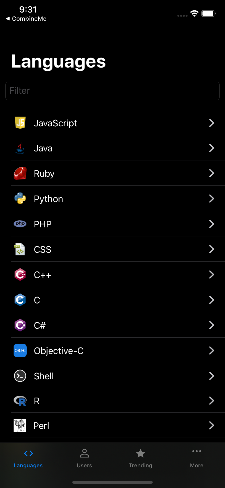

# ModernOctopodium
My SwiftUI/Combine learning process through migrating [Octopodium app](https://github.com/nunogoncalves/iOS-OctoPodium).

 

  

### TODOS
List of generic technical features that come to mind. 
- [ ] Error Handling
- [ ] Image loading
- [ ] Loading states
- [ ] Messages

### Requirements
- iOS 13+
- Xcode 11β7+

## License

ModernOctopodium is released under the MIT license. [See LICENSE](LICENSE) for details.
